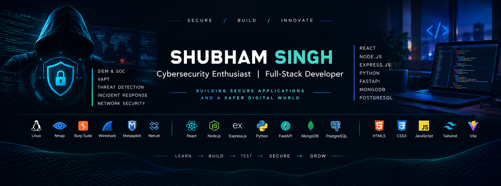

<div align="center">



</div>
<div align="center">


### Cybersecurity Enthusiast • Full-Stack Developer • Security Engineer

<p>
  
  
  
  
</p>

<p>
  <a href="https://github.com/singhshubham982047">
    
  </a>
  <a href="https://www.linkedin.com/in/shubhamsingh47">
    
  </a>
</p>

<br>

> **Building secure applications • Engineering security tools • Learning through hands-on projects**

</div>

---

<div align="center">

## 🔐 CYBERSECURITY × 💻 SOFTWARE ENGINEERING

</div>

<table>
<tr>
<td width="50%" valign="top">

### 🛡️ Cybersecurity

* 🔎 SIEM & Security Monitoring
* 🚨 SOC Operations
* 🎯 Threat Detection
* 🧠 Detection Engineering
* 🔐 Vulnerability Assessment
* 🕵️ Penetration Testing
* 🌐 Network Security
* 🕸️ Web Application Security
* 🐧 Linux Security
* 📊 Log Analysis
* 🚑 Incident Response
* ⚙️ Security Automation

</td>

<td width="50%" valign="top">

### 💻 Software Development

* ⚛️ React Development
* 🟨 JavaScript
* 🟢 Node.js
* 🚂 Express.js
* 🐍 Python
* ⚡ FastAPI
* 🗄️ PostgreSQL
* 🍃 MongoDB
* 🎨 Tailwind CSS
* 🔌 REST APIs
* 🔑 Authentication
* 🏗️ Backend Architecture

</td>
</tr>
</table>

---

<div align="center">

# 👨‍💻 About Me

</div>

I'm a **Cybersecurity Enthusiast and Full-Stack Developer** interested in building practical software and understanding how applications, systems, and networks can be secured.

My work sits at the intersection of **software development and cybersecurity**.

I enjoy building applications from the ground up while exploring security concepts such as:

**Threat Detection • VAPT • SIEM • SOC • Web Security • Network Security • Security Automation**

My approach is simple:

> **Understand the system → Build the system → Test the system → Secure the system**

--- 

<div align="center">

# 🛡️ Current Project

## Mini SIEM & Security Analytics Engine

</div>

I'm currently building a **Mini SIEM & Security Analytics Engine** to understand and implement core security monitoring and detection concepts.

<div align="center">

```text
                    ┌──────────────────────┐
                    │      SYSTEM LOGS     │
                    └──────────┬───────────┘
                               │
                               ▼
                    ┌──────────────────────┐
                    │    LOG COLLECTOR     │
                    └──────────┬───────────┘
                               │
                               ▼
                    ┌──────────────────────┐
                    │     LOG PARSER       │
                    └──────────┬───────────┘
                               │
                               ▼
                    ┌──────────────────────┐
                    │      POSTGRESQL      │
                    │    EVENT STORAGE     │
                    └──────────┬───────────┘
                               │
                               ▼
                    ┌──────────────────────┐
                    │   DETECTION ENGINE   │
                    └──────────┬───────────┘
                               │
                 ┌─────────────┼─────────────┐
                 ▼             ▼             ▼
             BRUTE FORCE   SUSPICIOUS    PORT SCAN
                            LOGIN
                 │             │             │
                 └─────────────┼─────────────┘
                               │
                               ▼
                    ┌──────────────────────┐
                    │        ALERT         │
                    └──────────┬───────────┘
                               │
                               ▼
                    ┌──────────────────────┐
                    │      INCIDENT        │
                    └──────────┬───────────┘
                               │
                               ▼
                    ┌──────────────────────┐
                    │  STREAMLIT SOC UI    │
                    └──────────────────────┘
```

### 🔥 Detection Capabilities

| Capability                 | Status |
| :------------------------- | :----: |
| Log Collection             |    ✅   |
| Log Parsing                |    ✅   |
| PostgreSQL Event Storage   |    ✅   |
| Detection Engine           |    ✅   |
| SSH Brute Force Detection  |    ✅   |
| Suspicious Login Detection |    ✅   |
| Multiple User Detection    |    ✅   |
| Port Scan Detection        |   🔄   |
| Alert Management           |    ✅   |
| Incident Management        |    ✅   |
| Event Correlation          |    ✅   |
| Streamlit SOC Dashboard    |   🔄   |
| AWS Deployment             |   📋   |

### 🧰 Technology Stack

<p>


</p>

🔗 **[View Mini SIEM Repository](https://github.com/singhshubham982047/mini-siem)**

---

<div align="center">

# 🚀 Featured Projects

</div>

<table>
<tr>
<td width="50%" valign="top">

## 🛡️ Mini SIEM

Security monitoring and analytics platform for collecting logs, analyzing events, detecting suspicious behavior, generating alerts, and managing incidents.

**Stack**

`Python` `PostgreSQL` `SQLAlchemy` `Streamlit` `Linux`

**Focus**

`SIEM` `SOC` `Threat Detection` `Log Analysis`

<br>

🔗 **[View Project →](https://github.com/singhshubham982047/mini-siem)**

</td>


</tr>


</table>

---

<div align="center">

# 💻 Full-Stack Development

### Frontend → Backend → Database → API → Security

</div>

## 🎨 Frontend

<p>

</p>

**Technologies**

`HTML5` `CSS3` `JavaScript` `React` `Tailwind CSS` `Vite`

---

## ⚙️ Backend

<p>

</p>

**Technologies**

`Node.js` `Express.js` `Python` `FastAPI` `REST APIs`

---

## 🗄️ Databases

<p>

</p>

**Technologies**

`PostgreSQL` `MongoDB` `SQL` `Database Design`

---

<div align="center">

# 🔐 Cybersecurity Stack

</div>

## 🛡️ Security Operations

<p>


</p>

* Security Event Monitoring
* Log Analysis
* Detection Rules
* Alert Investigation
* Event Correlation
* Incident Management

---

## 🎯 Offensive Security

<p>


</p>

* Reconnaissance
* Enumeration
* Vulnerability Assessment
* Web Application Testing
* Network Security Testing
* Security Testing Methodologies

---

## 🧰 Security Tools

<p>

</p>

`Nmap` • `Burp Suite` • `Wireshark` • `Metasploit` • `Netcat`

---

<div align="center">

# 🧠 Programming & Scripting

</div>

<p align="center">

</p>

| Language      | Usage                                            |
| :------------ | :----------------------------------------------- |
| 🐍 Python     | Security Automation • SIEM • Backend • Scripting |
| 🟨 JavaScript | Frontend • Backend • Web Applications            |
| 🐚 Bash       | Linux • Automation • Security                    |
| 🗄️ SQL       | Database Queries • Analytics • Data Management   |

---

<div align="center">

# ☁️ Cloud & Infrastructure

</div>

<p>

</p>

### Currently Exploring

`AWS` • `EC2` • `IAM` • `Cloud Security` • `Cloud Monitoring` • `Docker`

---

<div align="center">

# 🔭 Development Direction

</div>

```text
                         SHUBHAM SINGH
                               │
              ┌────────────────┴────────────────┐
              │                                 │
       🛡️ CYBERSECURITY                  💻 WEB DEVELOPMENT
              │                                 │
       ┌──────┼──────┐                    ┌─────┼─────┐
       │      │      │                    │     │     │
      SIEM   VAPT   SOC                 React Node  APIs
       │      │      │                    │     │     │
   Detection Web   Incident              JS  Express Backend
   Analytics Security Response            │     │     │
       │      │      │                    └─────┼─────┘
       └──────┼──────┘                          │
              │                                 │
              └──────────────┬──────────────────┘
                             │
                             ▼
                  🔐 SECURE APPLICATIONS
```

My long-term technical direction is around **building software with security in mind**, while developing deeper expertise in security monitoring, offensive security, and security engineering.

---

<div align="center">

# 📚 Currently Learning

</div>

<table>
<tr>
<td width="33%" valign="top">

### 🛡️ Cybersecurity

* Detection Engineering
* SIEM Architecture
* SOC Investigation
* Advanced VAPT
* Web Security
* Network Security
* Incident Response
* Security Automation

</td>

<td width="33%" valign="top">

### 💻 Development

* Advanced React
* Node.js
* Express.js
* Backend Architecture
* REST API Design
* Database Architecture
* Application Security
* Full-Stack Development

</td>

<td width="33%" valign="top">

### ☁️ Cloud

* AWS
* IAM
* EC2
* Cloud Logging
* Cloud Monitoring
* Cloud Security
* Deployment
* Infrastructure Security

</td>
</tr>
</table>

---

<div align="center">

# 🎯 Career Focus

</div>

```text
                    CYBERSECURITY
                         │
        ┌────────────────┼────────────────┐
        │                │                │
       SOC              VAPT        SECURITY ENGINEERING
        │                │                │
       SIEM          Pentesting      Automation
       Detection     Web Security    Python
       Analytics     Network Sec     Secure Apps
        │                │                │
        └────────────────┼────────────────┘
                         │
                         ▼
                SECURE SOFTWARE
                         │
                  WEB DEVELOPMENT
                         │
            React • Node • Express
            FastAPI • PostgreSQL
                  MongoDB
```

---

<div align="center">

# 📊 GitHub Statistics

<br>


<br><br>


</div>

---

<div align="center">

# 🐍 Contribution Activity

<br>


</div>

---

<div align="center">

# 🎯 My Development Philosophy

### Build it. Break it. Understand it. Secure it.

<br>

`LEARN` → `BUILD` → `TEST` → `ANALYZE` → `SECURE` → `IMPROVE`

</div>

---

<div align="center">

# 📫 Let's Connect

<br>

<a href="https://github.com/singhshubham982047">

</a>

<a href="[YOUR_LINKEDIN_URL](https://www.linkedin.com/in/shubhamsingh47)">

</a>

<a href="mailto:singhshubham982047@gmail.com">

</a>

<br><br>


<br><br>

### 🛡️ Cybersecurity • 💻 Development • 🚀 Continuous Learning

</div>
